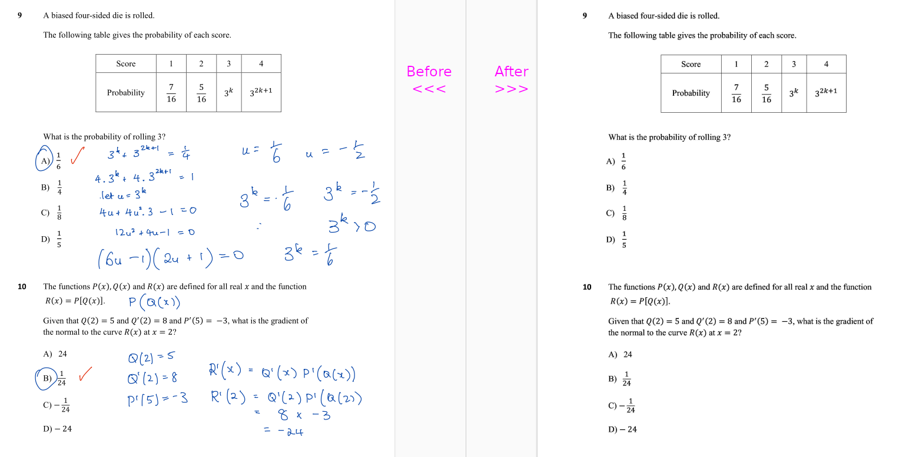

# pdfcleaner

Originally designed to remove hand written notes and solutions added
to examination papers, to allow for re-printing and re-use without
the notes getting in the way

Utility to clean up pdfs that have been annotated in a predictable
way that might be able to be fixed by removing coloured annnotations

Filtering is based primarily on RGB colour levels, although there is
also a very basic filter based on the absolute x/y co-oprdinate to 
allow for ignoring large parts of a page if required.

An example before and after is below:

Designed for personal projects, so expect a bit of tweaking colour
values and that sort of thing depending on the way in which your
pdf / scans have been marked up.
